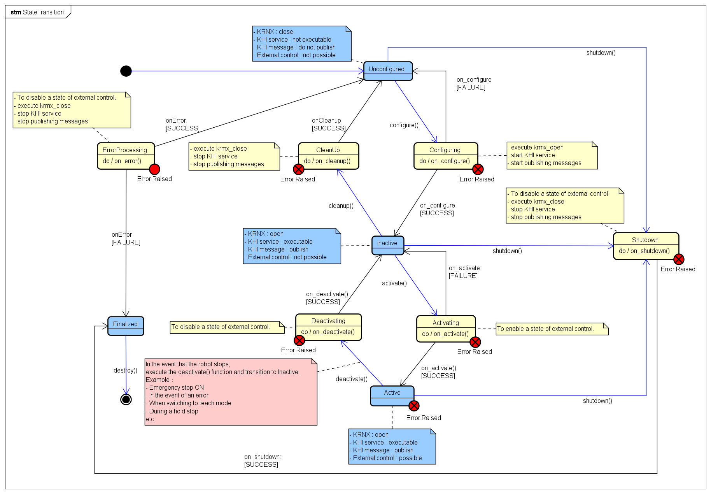
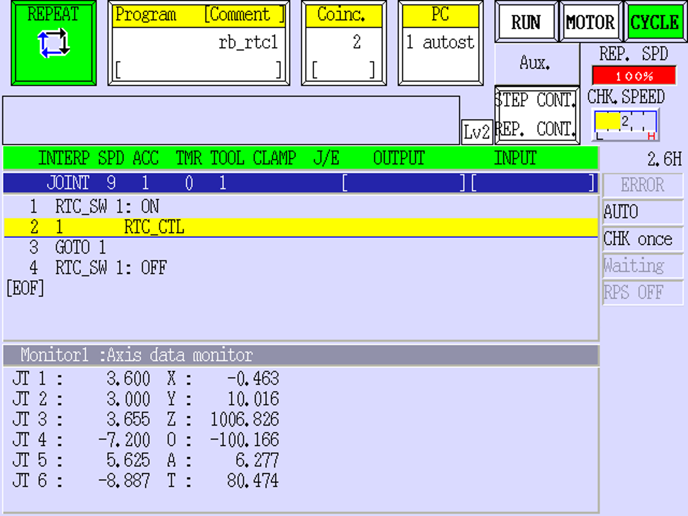
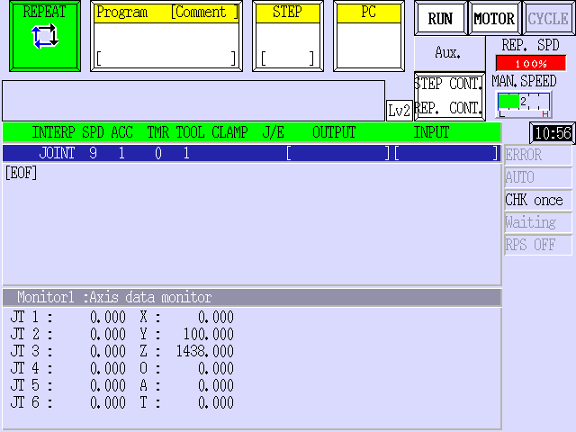

# Lifecycle of ROS2 Node:

## State

### Unconfigured
- Khi Services: Unavailable
- Khi Publishers: Unavailable
- Khi Robot Operation: Not possible

### Inactive
- Khi Services: Available
- Khi Publishers: Available
- Khi Robot Operation: Not possible

### Active
- Khi Services: Available
- Khi Publishers: Available
- Khi Robot Operation: Possible

### Finalized
- Khi Services: Unavailable
- Khi Publishers: Unavailable
- Khi Robot Operation: Not possible

## Screen on the Teach Pendant:

### State: Active

### State: Others

## State Transition Method
You can perform state transitions using `controller_manager_msgs/srv/SetHardwareComponentState` provided by [ros2_control](https://github.com/ros-controls/ros2_control/blob/master/controller_manager_msgs/srv/SetHardwareComponentState.srv).

(e.g.) `ros2 control set_hardware_component_state <robot_name> active`

## State Verification Method
You can check the current state using controller_manager_msgs/srv/ListHardwareComponents provided by [ros2_control](https://github.com/ros-controls/ros2_control/blob/master/controller_manager_msgs/srv/ListHardwareComponents.srv).

(e.g.) `ros2 control list_hardware_components`
